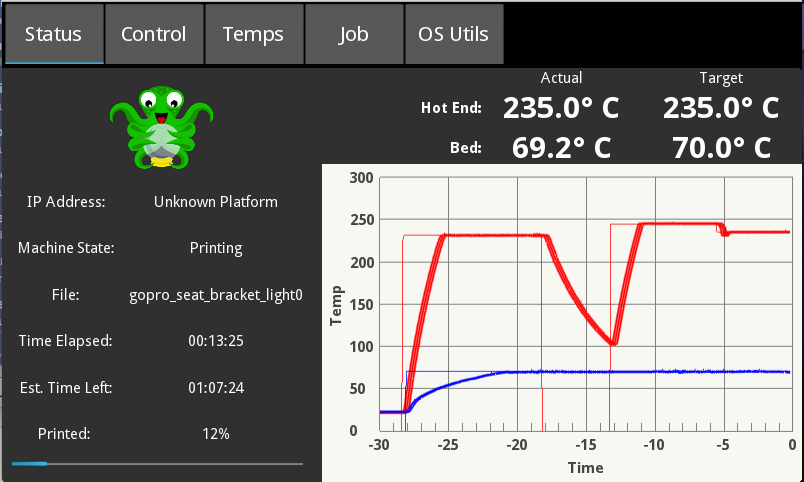
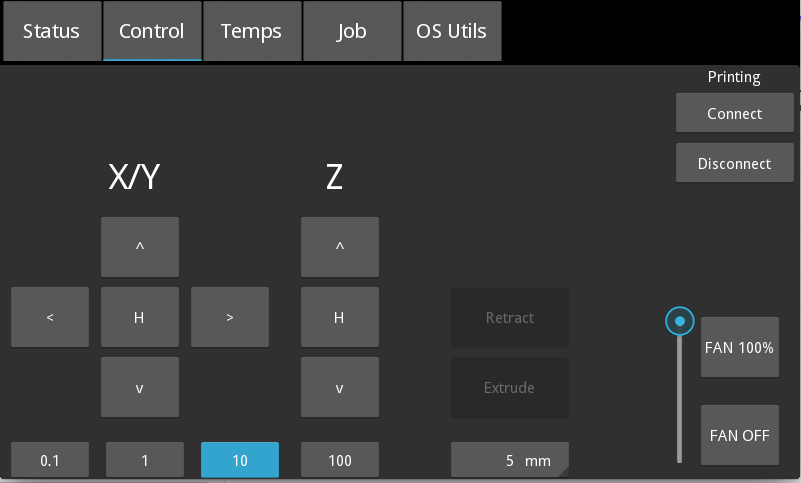
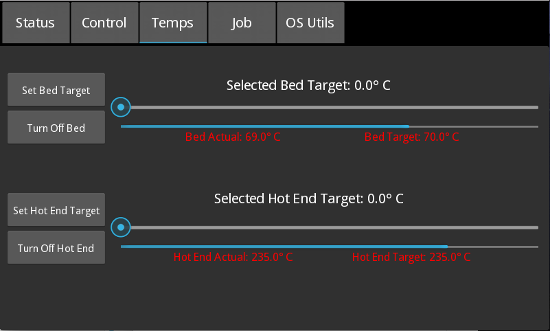
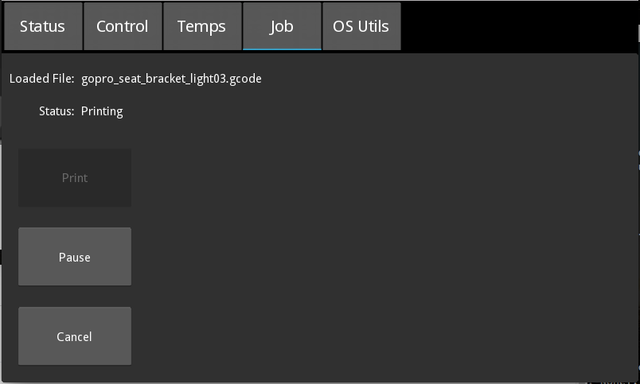
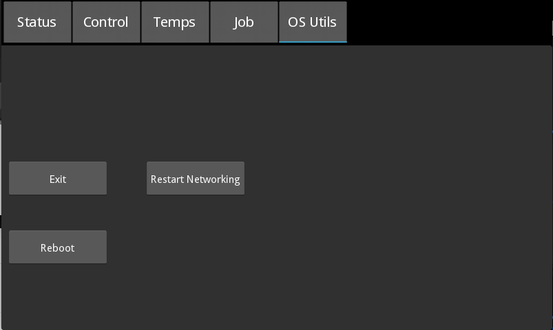

# OctoPiTouchPanel
Touchscreen interface for OctoPrint using the kivy gui framework

The layout is designed for the official Raspberry Pi Foundation 7" touchscreen. I would recommend using the Raspberry Pi 2 or 3 Model B for the Octoprint server. I think the Pi 1 might be a bit under powered for running this touchscreen app.

# Installation
Big thanks to Tim Vaillemans for documenting this installation process.
## Installation for python2
<pre>
Install OctoPi (https://octopi.octoprint.org/)
ssh to your Octoprint server
sudo su -
apt-get update
apt-get upgrade
apt-get install python-pip
sudo apt-get install libsdl2-dev libsdl2-image-dev libsdl2-mixer-dev libsdl2-ttf-dev \
   pkg-config libgl1-mesa-dev libgles2-mesa-dev \
   python-setuptools libgstreamer1.0-dev git-core \
   gstreamer1.0-plugins-{bad,base,good,ugly} \
   gstreamer1.0-{omx,alsa} python-dev libmtdev-dev \
   xclip
pip install -U Cython==0.27.3
pip install git+https://github.com/kivy/kivy.git@master
pip install kivy-garden
garden install graph
</pre>

## Installation for python3
<pre>
Install OctoPi 0.16 or higher (https://octopi.octoprint.org/)
ssh to your Octoprint server
sudo apt-get update
sudo apt-get upgrade
sudo apt-get install python3 python3-pip python3-dev python3-setuptools
sudo apt-get install libsdl2-dev libsdl2-image-dev libsdl2-mixer-dev libsdl2-ttf-dev \
   pkg-config libgl1-mesa-dev libgles2-mesa-dev git-core \
   gstreamer1.0-plugins-{bad,base,good,ugly} libgstreamer1.0-dev \
   gstreamer1.0-{omx,alsa}  libmtdev-dev xclip

python3 -m pip install --upgrade --user pip wheel setuptools
python3 -m pip install --upgrade --user Cython==0.29.10 pillow PySDL2
python3 -m pip install --user git+https://github.com/kivy/kivy.git@master
~/.local/bin/garden install --upgrade graph
</pre>

## Configure kivy to use the touchscreen input
[Copied from https://kivy.org/docs/installation/installation-rpi.html] 
If you are using the official Raspberry Pi touch display, you need to configure Kivy to use it as an input source. To do this, edit the file ~/.kivy/config.ini and go to the [input] section. Add this:
<pre>
mouse = mouse
mtdev_%(name)s = probesysfs,provider=mtdev
hid_%(name)s = probesysfs,provider=hidinput
</pre>

## Disable console screen blanking
Raspbian Jessie has console screen blanking turned on by default. It is set to 600 seconds. To disable this you must edit this file:
<pre>
vi /boot/cmdline.txt
</pre>

After 'console=tty1' add 'consoleblank=0'. Your cmdline.txt should look something like this:
<pre>
dwc_otg.lpm_enable=0 console=serial0,115200 console=tty1 consoleblank=0 root=PARTUUID=17e26144-02 rootfstype=ext4 elevator=deadline fsck.repair=yes rootwait
</pre>
Note the cmdline.txt file must be a single line of text. After saving this file reboot your Pi.

## Clone this repo
<pre>
cd ~
git clone https://github.com/matt448/OctoPiTouchPanel.git
</pre>

## Configure OctoPiTouchPanel
<pre>
cd OctoPiTouchPanel
cp octoprint.cfg.sample octoprint.cfg
edit octoprint.cfg (with vim, nano, etc.)
The important items to edit are in the APISettings section.
- host: should almost always be 127.0.0.1
- apikey: get API key from your octoprint webpage. Looks something like AADDEEDD0BA48F891F3966F856765FB
- nicname: Use ifconfig to identify network interface Looks something like eth0 or wlan0
</pre>

## Configure system to start touchscreen app on boot
Older Linux distros use start scripts in /etc/init.d. Newer Linux distros use start scripts in /etc/systemd/system.
I've included both with this project but since systemd is now the standard I will detail how to set that up.
<pre>
sudo cp OctoPiTouchPanel/etc/systemd/system/touchscreen.service /etc/systemd/system
sudo chmod +x /etc/systemd/system/touchscreen.service
sudo systemctl enable touchscreen
</pre>
The touchscreen app should now launch when the Pi boots up.

## Manually starting and stopping the app
<pre>
sudo systemctl start touchscreen
sudo systemctl stop touchscreen
</pre>

# Screenshots

 

  

  

   

  

   

  

   

  
