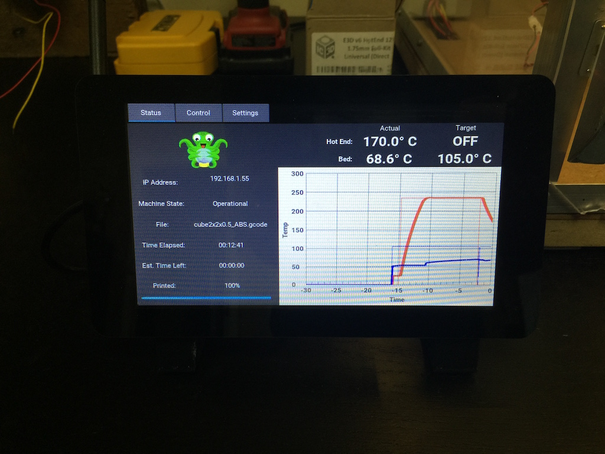
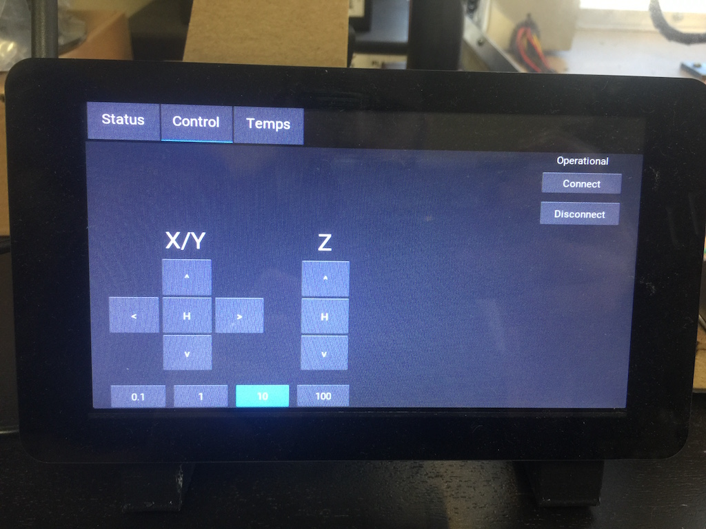
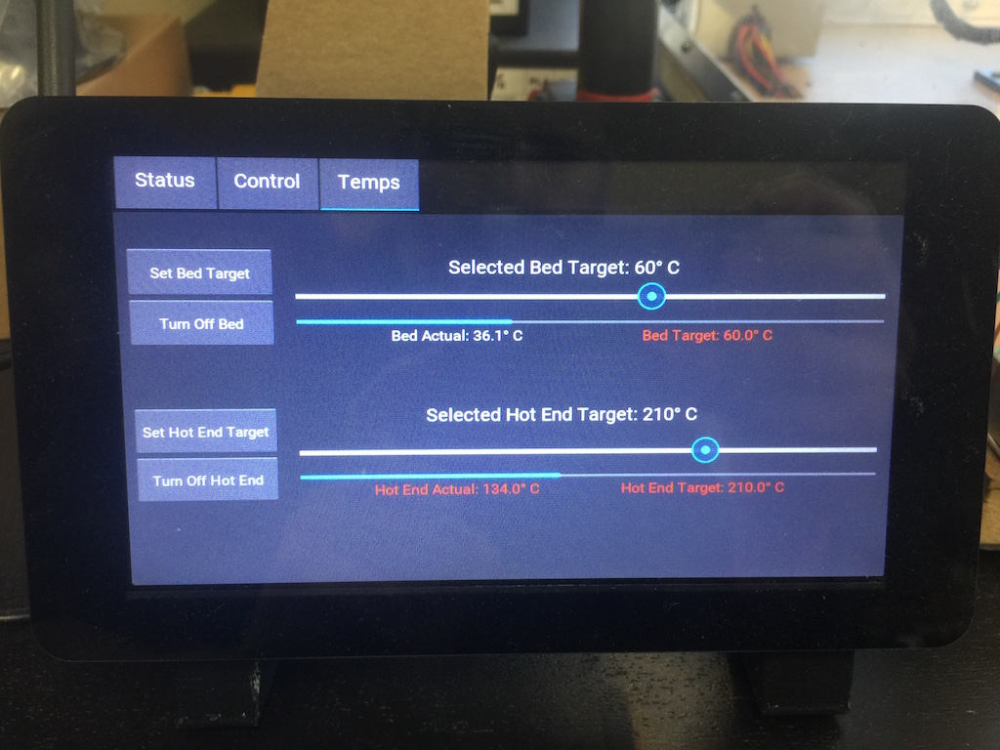

# OctoPiTouchPanel
Touchscreen interface for OctoPrint using the kivy gui framework

The layout is designed for the official Raspberry Pi Foundation 7" touchscreen. I would recommend using the Raspberry Pi 2 or 3 Model B for the Octoprint server. I think the Pi 1 might be a bit under powered for running this touchscreen app.

# Installation
Big thanks to Tim Vaillemans for documenting this installation process.
## Install prerequisites
<pre>
Install OctoPi (https://octopi.octoprint.org/)
ssh to your Octoprint server
sudo su -
apt-get update
apt-get upgrade
apt-get install python-pip
apt-get install python-pygame
pip install Cython
pip install kivy (Kivy-Garden is included)
garden install graph
</pre>

## Configure kivy to use the touchscreen input
[Copied from https://kivy.org/docs/installation/installation-rpi.html] 
If you are using the official Raspberry Pi touch display, you need to configure Kivy to use it as an input source. To do this, edit the file ~/.kivy/config.ini and go to the [input] section. Add this:
<pre>
mouse = mouse
mtdev_%(name)s = probesysfs,provider=mtdev
hid_%(name)s = probesysfs,provider=hidinput
</pre>

## Clone this repo
<pre>
cd /root
git clone https://github.com/matt448/OctoPiTouchPanel.git
</pre>

## Configure OctoPiTouchPanel
<pre>
cd OctoPiTouchPanel
cp octoprint.cfg.sample octoprint.cfg
edit octoprint.cfg (with vim, nano, etc.)
The important items to edit are in the APISettings section.
- host: should almost always be 127.0.0.1
- apikey: get API key from your octoprint webpage. Looks something like AADDEEDD0BA48F891F3966F856765FB
- nicname: Use ifconfig to identify network interface Looks something like eth0 or wlan0
</pre>

## Starting the app
<pre>
cd /root/OctoPiTouchPanel
python /root/OctoPiTouchPanel/main.py
</pre>
or to start the app in the background
<pre>
python /root/OctoPiTouchPanel/main.py &
</pre>

# Screenshots

 
 
  
 
  
  
   
  
  
